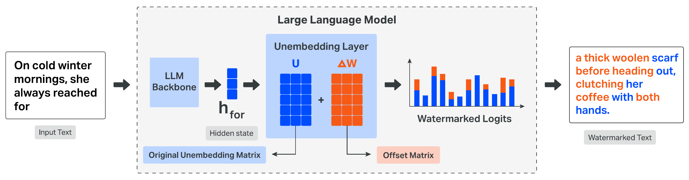

# How OpenStamp Works

OpenStamp watermarks an open-weight LLM by modifying its **unembedding** (final projection) layer, then detects the signal in generated text with a length-normalized log-likelihood ratio between the released watermarked checkpoint and a privately retained base model.

  

## Unembedding modification

At each generation step, logits are formed from the prefix hidden state $h_t = f(x_{\le t}) \in \mathbb{R}^d$ and the unembedding matrix $U \in \mathbb{R}^{|\mathcal{V}| \times d}$:

$$
v_t = U h_t \in \mathbb{R}^{|\mathcal{V}|}.
$$

OpenStamp embeds the watermark by adding an **offset matrix** $\Delta W$:

$$
\tilde{U} = U + \Delta W,
$$

so the modified logits are $\tilde{v}_t = v_t + \Delta W h_t$. The term $\Delta W h_t$ is the **watermark logits**: it biases sampling toward favored tokens, and that bias accumulates into a detectable signal in the generated text.

An effective offset should be detectable, controllable in strength, hard to reverse-engineer, and robust to paraphrasing.

## Factorized offset $\Delta W = GSP$

OpenStamp adapts the [KGW](https://arxiv.org/abs/2301.10226) green-list idea as a linear map from hidden states to watermark logits. Instead of a PRF over token prefixes, it uses a finite set of $L$ candidate green lists and factorizes the offset as

$$
\Delta W = G S P.
$$

The three factors play distinct roles:

1. **Semantic alignment** ($P$): project $h_t$ so that geometrically nearby states behave similarly under the watermark (important for paraphrasing).
2. **List selection** ($S$): map the projected state to a soft selector over the $L$ green lists.
3. **Logit biasing** ($G$): turn that selector into vocabulary-sized watermark logits that encode the chosen green list(s).

### Projection matrix $P$

LLM hidden states are trained for next-token prediction and need not cluster by meaning. $P \in \mathbb{R}^{d \times d}$ maps $h_t$ into a space where proximity reflects semantic similarity. It is trained on pairs of hidden states and sentence embeddings $\{(h_i, e_i)\}$ by matching batch-wise similarity distributions. For a batch $\mathcal{B}$ and temperature $T_{\mathrm{sim}} > 0$,

$$
\mathcal{L}(P) = \frac{1}{|\mathcal{B}|} \sum_{i \in \mathcal{B}} D_{\mathrm{KL}}\Big( \mathrm{softmax}(\mathbf{s}^P_i / T_{\mathrm{sim}}) \;\Big\|\; \mathrm{softmax}(\mathbf{s}^e_i / T_{\mathrm{sim}}) \Big),
$$

where $[\mathbf{s}^P_i]_j = \cos(Ph_i, Ph_j)$ and $[\mathbf{s}^e_i]_j = \cos(e_i, e_j)$. Minimizing this loss pushes projected states to inherit the geometry of the target embedding space, so paraphrases tend to activate similar watermark behavior.

**Training details.** Hidden states come from the final layer of the target LLM; target embeddings use Qwen3-Embedding-8B. Pairs are drawn from OpenWebText ($1.5$M pairs, max length $512$). Optimization uses AdamW with learning rate $10^{-5}$, weight decay $10^{-2}$, and $T_{\mathrm{sim}} = 0.1$ for $15$ epochs.

### Selector matrix $S$

$S \in \mathbb{R}^{L \times d}$ produces $s = S P h_t \in \mathbb{R}^L$, a soft selector over $L$ green lists. Projected states are clustered with $k$-means into $L$ groups, yielding labels $y_i$. $S$ is then fit by ridge regression:

$$
\min_S \sum_{(Ph_i, y_i)} \left\| S Ph_i - y_i \right\|^2 + \lambda \| S \|_F^2.
$$

**Training details.** Hidden states use the same extraction protocol as for $P$. Projected states are partitioned with incremental $k$-means; clusters with fewer than $10$ states are discarded. Ridge regression uses $\lambda = 10^{-3}$.

Because selection is soft, several green lists can be partially active at once. Detection still works well because the LLR uses the full continuous mixture rather than collapsing to a single discrete list.

### Green-list matrix $G$

$G \in \mathbb{R}^{|\mathcal{V}| \times L}$ stores $L$ green lists as columns. For list $l$, membership is keyed by a PRF and secret seed:

$$
\mathcal{G}_l = \{ i \mid \mathrm{PRF}(\mathrm{seed}, l, i) < \gamma \},
\qquad
G_{i,l} = \delta \cdot \mathbf{1}\{ i \in \mathcal{G}_l \}.
$$

As in KGW, $\gamma$ and $\delta$ control green-list size and boost strength (detectability vs. text quality). Favored tokens change with the hidden state, so the rule is context-dependent—an indirect proxy for reverse-engineering difficulty relative to a single static preference.

## Detection via LLR

Detection scores a sequence with a **length-normalized log-likelihood ratio** under the watermarked and original models:

$$
\mathrm{LLR}(x) = \frac{1}{T-1} \sum_{t=1}^{T-1} \log \frac{p_{\mathrm{wm}}(x_{t+1} \mid x_{\le t})}{p_{\mathrm{orig}}(x_{t+1} \mid x_{\le t})}.
$$

Watermarked generations tend to accumulate higher LLR values. Length normalization lets one threshold apply across sequence lengths. Detection does **not** require the original generation prompt: scoring the continuation alone is typically enough.

Unlike count-based KGW tests, this LLR is not a formal hypothesis test with a known null, because “unwatermarked” covers human text and other models. Thresholds are therefore calibrated empirically. The upside is that the score uses the full token distribution and preserves mixture-of-lists signal that discrete green-token counts discard.

### Release assumption

The intended release publishes only the watermarked checkpoint $\tilde{U} = U + \Delta W$ and keeps the original $U$ private for verification. Detection needs white-box likelihoods under both models. If $U$ were also public, an adversary could recover $\Delta W = \tilde{U} - U$.

**Algorithm (sketch).** Given sequence $x$, backbone $f$, matrices $U$ and $\Delta W$, and threshold $\tau$:

1. Compute hidden states $h_1, \ldots, h_T = f(x)$.
2. $\ell_{\mathrm{orig}} \leftarrow \sum_t \log \mathrm{softmax}(U h_t)[x_{t+1}]$
3. $\ell_{\mathrm{wm}} \leftarrow \sum_t \log \mathrm{softmax}((U + \Delta W) h_t)[x_{t+1}]$
4. $\mathrm{LLR}(x) \leftarrow (\ell_{\mathrm{wm}} - \ell_{\mathrm{orig}}) / (T - 1)$
5. Return watermarked iff $\mathrm{LLR}(x) > \tau$.
