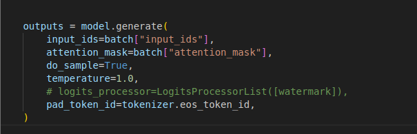
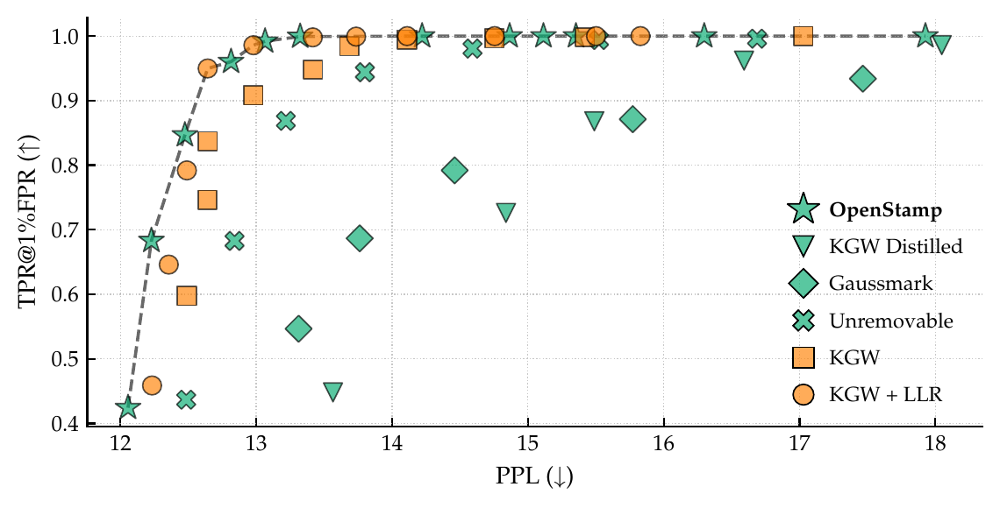
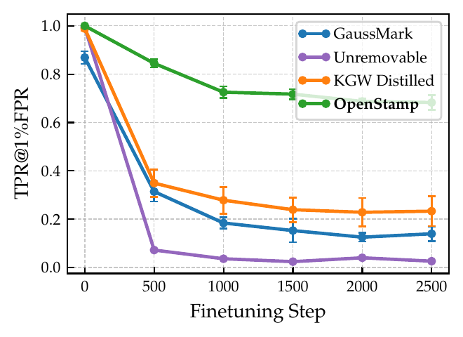
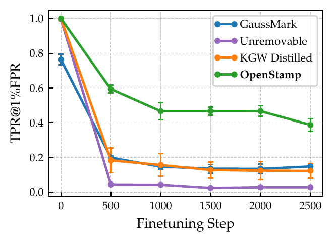

# OpenStamp

Watermarking for open-weight language models.

## Background

Most LLM watermarks work by tweaking token sampling at generation time. That is fine when you control the API, but once you release the weights, anyone can turn the watermark off and still get fluent text.

<p align="center">
  
</p>

So for open models, the watermarking logic has to be baked into the weights. It also has to survive common post-release changes: quantization, fine-tuning, and paraphrasing of the output. Existing open-weight methods often break under those conditions.

**OpenStamp** adds a small, factorized offset to the unembedding layer. Sampling from the released checkpoint then produces watermarked text. To detect, we compare a length-normalized log-likelihood ratio between that checkpoint and a privately held copy of the base model. Details are in [How it works](METHOD.md).

<p align="center">
  
</p>

OpenStamp sits near the top of the quality–detectability tradeoff: near-perfect detection at low false-positive rates, with perplexity in line with earlier open-weight baselines.

<p align="center">
  
</p>

It is not perfect under attack. After LLM paraphrasing, TPR@1% FPR drops from nearly 1.0 to about 0.91 on Llama-2-7B and 0.79 on Mistral-7B. LoRA fine-tuning weakens the signal further. OpenStamp still outperforms GaussMark, KGW Distilled, and Unremovable, but detection performance degrades as fine-tuning continues:

<p align="center">
  
  
</p>

## Setup

```bash
conda create -n openstamp python=3.12 -y
conda activate openstamp
pip install torch torchvision --index-url https://download.pytorch.org/whl/cu128
pip install flash-attn --no-build-isolation
pip install -r requirements.txt
```

## Download models

By default the pipeline uses `meta-llama/Llama-2-13b-hf` as the PPL oracle and `Qwen/Qwen2.5-14B-Instruct` for paraphrasing. Download both from Hugging Face:

```bash
hf download meta-llama/Llama-2-13b-hf
hf download Qwen/Qwen2.5-14B-Instruct
```

Download the models used for testing:

```bash
hf download meta-llama/Llama-2-7b-hf
hf download mistralai/Mistral-7B-v0.3
```

## Run experiments

Generate watermarked samples and evaluate detection:

```bash
python scripts/run_config.py \
	--config experiment_configs/openstamp.yaml \
	--base_output_dir output/main \
	--num_samples 500 \
	--paraphrase \
	--eval_ppl
```

Aggregate metrics across seeds into a CSV:

```bash
python scripts/aggregate_metrics.py \
	--input-dir output/main \
	--output-csv results/aggregated_metrics.csv
```

Configs live in `experiment_configs/`:

- [OpenStamp](experiment_configs/openstamp.yaml)
- [KGW](experiment_configs/kgw.yaml) ([Kirchenbauer et al.](https://arxiv.org/abs/2301.10226))
- [KGW+LLR](experiment_configs/kgw_llr.yaml) ([Kirchenbauer et al.](https://arxiv.org/abs/2301.10226); LLR detector from OpenStamp)
- [GaussMark](experiment_configs/gaussmark.yaml) ([Block et al.](https://arxiv.org/abs/2501.13941))
- [KGW Distilled](experiment_configs/distilled.yaml) ([Gu et al.](https://arxiv.org/abs/2312.04469))
- [Unremovable](experiment_configs/unremovable.yaml) ([Christ et al.](https://arxiv.org/abs/2410.18861))

## Watermarked models

- [openstamp/phi-4-openstamp-L250-delta1.0-gamma0.25](https://huggingface.co/openstamp/phi-4-openstamp-L250-delta1.0-gamma0.25)
- [openstamp/olmo-3-1025-7b-openstamp-L253-delta1.0-gamma0.25](https://huggingface.co/openstamp/olmo-3-1025-7b-openstamp-L253-delta1.0-gamma0.25)
- [openstamp/smollm2-1.7b-openstamp-L254-delta1.0-gamma0.25](https://huggingface.co/openstamp/smollm2-1.7b-openstamp-L254-delta1.0-gamma0.25)
- [openstamp/mistral-7b-v0.3-openstamp-L254-delta1.0-gamma0.25](https://huggingface.co/openstamp/mistral-7b-v0.3-openstamp-L254-delta1.0-gamma0.25)
- [openstamp/qwen2.5-7b-openstamp-L251-delta1.0-gamma0.25](https://huggingface.co/openstamp/qwen2.5-7b-openstamp-L251-delta1.0-gamma0.25)
- [openstamp/llama2-7b-openstamp-L254-delta1.0-gamma0.25](https://huggingface.co/openstamp/llama2-7b-openstamp-L254-delta1.0-gamma0.25)

### Generate text

Load a watermarked model with `transformers` and call `generate` as usual—the watermark is already in the weights.

```python
import torch
from transformers import AutoModelForCausalLM, AutoTokenizer

MODEL_ID = "openstamp/llama2-7b-openstamp-L254-delta1.0-gamma0.25"

tokenizer = AutoTokenizer.from_pretrained(MODEL_ID)
if tokenizer.pad_token is None:
    tokenizer.pad_token = tokenizer.eos_token

model = AutoModelForCausalLM.from_pretrained(
    MODEL_ID,
    torch_dtype=torch.bfloat16,
    device_map="auto",
)

prompt = "Once upon a time there was a wise old sage who"
inputs = tokenizer(prompt, return_tensors="pt").to(model.device)
outputs = model.generate(**inputs, max_new_tokens=256, do_sample=True, temperature=0.7)
watermarked_text = tokenizer.decode(outputs[0], skip_special_tokens=True)
print(watermarked_text)
```

### Detect watermarked text

Text is marked as watermarked when the LLR score is above a threshold you choose (calibrate it on your data).

```python
import json
import torch
from huggingface_hub import hf_hub_download
from transformers import AutoModelForCausalLM, AutoTokenizer

from src.openstamp import OpenStamp, Mode

MODEL_REPO = "openstamp/llama2-7b-openstamp-L254-delta1.0-gamma0.25"
BASE_MODEL_ID = "meta-llama/Llama-2-7b-hf"

dtype = torch.bfloat16 if torch.cuda.is_available() else torch.float32

tokenizer = AutoTokenizer.from_pretrained(BASE_MODEL_ID)
if tokenizer.pad_token is None:
    tokenizer.pad_token = tokenizer.eos_token

model = AutoModelForCausalLM.from_pretrained(
    BASE_MODEL_ID, torch_dtype=dtype, device_map="auto"
)

with open(hf_hub_download(MODEL_REPO, "watermark_config.json")) as f:
    wm_cfg = json.load(f)

final_weight = torch.load(
    hf_hub_download(MODEL_REPO, "selector_matrix.pth"), map_location="cpu"
)

watermark = OpenStamp.from_config(
    delta=wm_cfg["delta"],
    gamma=wm_cfg["gamma"],
    seed=wm_cfg["seed"],
    final_weight=final_weight,
    model=model,
    tokenizer=tokenizer,
    unembedding_param_name="lm_head",
    mode=Mode.Detect,
)

watermarked_text = "<insert watermarked text here>"
THRESHOLD = 0.0  # calibrate on your dataset

scores = watermark.score_text_batch([watermarked_text])
llr = float(scores[0])
is_watermarked = llr > THRESHOLD
print(llr, is_watermarked)
```
